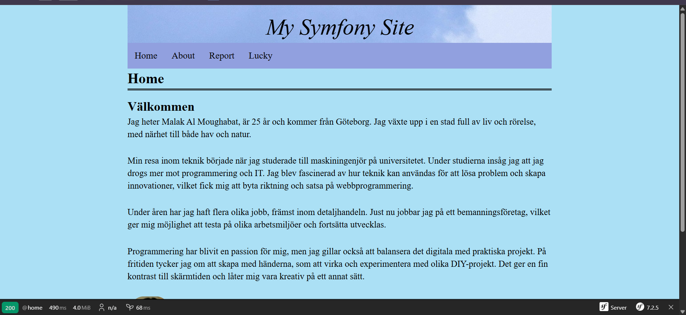

<!--
---
author: Makw24
revision:
    "2025-04-21": "(A, makw24) First release."
---
-->


Welcome to my webbpage!
====================
This project includes multiple pages with different purposes. From personal introductions to course reflections and page with fortune messages.

Overview
====================
- Home: A brief introduction about me.
- About: A page describing the course and the MVC structure.
- Report: My course reflections and written reports (Kmom).
- Lucky: A dynamic page that shows a random fortune message with an image every time you reload.
- API: A landing page with links for different JSON-response.


How to get started!
====================
Make sure to have the following packages installed:

# Prerequisites
- PHP
- Composer
- Node.js and npm

The project uses [Webpack Encore](https://symfony.com/doc/current/frontend/encore/installation.html) (configured in `package.json`) to manage and build frontend assets.

## Get started with the project

1. Clone the repository

git clone https://github.com/malakalm99/Webpage-symfony

2. Move into the project directory

cd me/report

3. Install PHP dependencies

composer install

composer require twig

composer require symfony/webpack-encore-bundle

4. Install JavaScript dependencies

npm install

5. Build frontend assets using Webpack Encore

npm run build

6. Install the symfony-cli to use symfony's local server

Bash Windows WSL/Linux

curl -1sLf 'https://dl.cloudsmith.io/public/symfony/stable/setup.deb.sh' | sudo -E bash

sudo apt install symfony-cli

7. Start the local web server

symfony server:start

```

You can reach the server through http://127.0.0.1:8000

Extra tools
====================
The tool bin/console is a utility that can help develop and troubleshoot your application. Here are some useful commands and how to use them. 

# Show the routes
bin/console debug:router

# Match a specific route
bin/console router:match /lucky/number

# Clear the cache
bin/console cache:clear

# Show available commands
bin/console list
